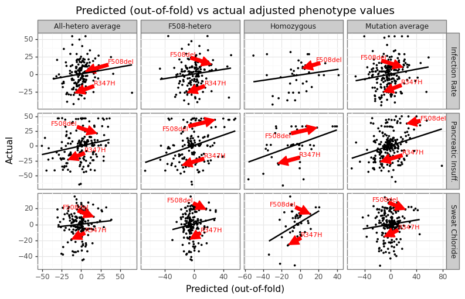

# ESMFold embeddings and CFTR2 clinical outcomes

This repo contains the code required to reproduce the analysis seen in the following [bioRxiv paper](https://www.biorxiv.org) ("Association between Cystic Fibrosis outcomes ESMFold Embeddings") and [technical post](http://www.erikdrysdale.com/cftr2_esmfold/) ("Using ESMFold to predict Cystic Fibrosis outcomes"). 

The readme is structured in the numerical order that scripts should be run to ensure reproducability. Many of the data files that get generated during this pipeline are not stored on the repo (e.g. html files, embeddings), and will need to be re-created by the user.

The pipeline.sh script shows the order in which the scripts can be run (in theory). In practice, the pipeline will need to be run in chunks unless script 5 (ESMFold) can be run locally. However, the original analysis leveraged a [cloud computing](https://cloud.lambdalabs.com) resource at this stage.

 

## (1) Setting up conda environment

The conda environment used in this pipeline (`cftr`) can be installed directrly from the `conda env create -f env.yml`. This repo has been tested on a macOS Ventura 13.1. After the conda environment is setup, the user will also have to install the human reference genome GRCh38: `pyensembl install --release 75 76 --species human`.

 

## (2) Downloading CFTR2 data

Scripts (1)-(4) are designed to download and process the phenotype and genotype information associated with the different CFTR mutations. 

* [1_scrape_cftr2.py](1_scrape_cftr2.py): Extracts the clinical averages for all [single variant](data/cftr2_uni.csv) and [two variant](data/cftr2_comb.csv) combinations. Four clinical phenotypes are measured: sweat choloride concentration (`sweat`), lung function - FEV1% - by age range (`lung`), pancreatic insufficiency % (`PI`), and Pseudomonas infection rate % (`infection`). See the `column_headers` dict in the utils.py script for where these columns are defined. The mutation names will be based on the current CFTR list on the [mutation history](https://cftr2.org/mutations_history) page, which as of the time of this analysis was the CFTR2_29April2022.xlsx file.
* [2_get_ncbi.py](2_get_ncbi.py): Using the mutation names from CFTR2, this script will search google for NCBI links associated with that specific name and save the searched results as local HTML files, and then write a [csv file](data/ncbi_links.csv) which has a list of possible NCBI page links for each mutation.
* [3_scrape_ncbi.py](3_scrape_ncbi.py): This script will download each of the NCBI pages locally, and then look to see if the genomic coordinate is provided. A list of [possible locations](data/dat_href.csv) is first calculated and saved as a CSV, and then a [final one](data/ncbi_genome_loc.csv) is chosen based on comparing the Levenshtein distance of the mutation name found on the NBCI page.
* [4_cftr_gene.py](4_cftr_gene.py): This script generates i) a [base reference](data/cftr_exon_locs.csv) of the exonic sequence of the CFTR gene from GRCh38 using Ensembl, and ii) an [amino acid sequence](data/cftr_polypeptides.csv) for each exonic mutation. The name of the mutation determine whether the mutation is trated as a insertion, deletion, or mutation (e.g. `c.1006_1007insG` would add a DNA base at a specific location).

 

## (3) Running ESMFold

Being able to run ESMFold at any reasonable speed means having access to a GPU. The [5_esm_fold.py](5_esm_fold.py) script was run on an A100 instance on [Lambda Cloud](https://cloud.lambdalabs.com/). The [lambda_cloud_setup.sh](lambda_cloud_setup.sh) has been written so that users can run this script on a cloud instance and set up the necessary packages. The order of operations used by this analysis was as follows:

1. On the local machine, assign variables for the remote IP and local path to this repo (e.g. `lambda_ip=ubuntu@XXX.XXX.XXX.XXX` and `path_cftr2=~/cftr2_esmfold`). You can check that the remote connect works by trying `ssh -i ~/.ssh/id_rsa $lambda_ip`.
2. From the local machine, run the following three `scp` commands to send over the relevant files needed:
    * `scp -i ~/.ssh/id_rsa $path_cftr2/lambda_cloud_setup.sh $lambda_ip:~/`
    * `scp -i ~/.ssh/id_rsa $path_cftr2/5_esm_fold.py $lambda_ip:~/`
    * `scp -i ~/.ssh/id_rsa $path_cftr2/data/cftr_polypeptides.csv $lambda_ip:~/`
3. (Optional) On VSCode, go to remote explorer, configure the .ssh/config file with the IP address (e.g. XXX.XXX.XXX.XXX), and then connect to session.
4. On the remote machine, run the script: `python3 5_esm_fold.py --chunk_size 64 --num_recycles 3 --chain_linker 25 --fp_precision 16 --min_amino_acids 100`.
5. After the script is complete, you the folder on the remote machine `tar -zcvf esm_fold.tar.gz data/esmfold`.
6. On the local machine, download the data (several options are listed below):
    * `scp -i ~/.ssh/id_macbook $lambda_ip:~/data/esmfold/*.npy $path_cftr2/data/esmfold`
    * `scp -i ~/.ssh/id_rsa $lambda_ip:~/esm_fold.tar.gz $path_cftr2`
    * `rsync -a --ignore-existing $path_cftr2/data/esmfold $lambda_ip:~/data/esmfold/*.npy`

There will be a `data/esmfold/{mutant}.npy` file for 311 different mutations.

 

## (4) Running predictive models

Scripts (6)-(9) take the embedding and label data generated by the previous data part of the pipeline, and structure the data in a way that usage for ML algorithms, generate summary statistics, and fit and evaluate a machine learning model.

* [6_process_Xy.py](6_process_Xy.py): Creates the different different clinical outcomes (phenotypes) for each genotype ([y_label.csv](data/y_label.csv)). There are multiple possible labels for each genotype both because of the different measures (e.g. sweat vs infection) but also the different ways of quantification a given mutation (e.g. should F508del use its homozygous combination, or an average over heterozygotes). The feature data is either the different moments of the embeddings ([mutant_embeddings.csv](data/mutant_embeddings.csv)) or the different moments of the cosine similarity between the wild-type CFTR gene mutant CFTR gene embeddings from ESMFold ([mutant_cosine.csv](data/mutant_cosine.csv)).
* [7_summary_stats.py](7_summary_stats.py): Generates a variety of figures examining the runtime, genomic locations, and distributions over the various label measures.
* [8_debias_y.py](8_debias_y.py): Uses a non-parametric regression model to adjust the various outcome measures for the amino acid length of the protein to adjust for confounding ([y_adjusted.csv](data/y_adjusted.csv)). In the absense of this judgement, a substantial amount of variation of the clinical outcomes can be accounted for by the fact that mutations that lead to early stop codons tend to have worse phenotypic outcomes.
* [9_predict_y.py](9_predict_y.py): Uses the residuals from the previous script, a simple two-layer feedforward neural network is trained on the embedding features and 5-fold CV is used to assess out-of-fold accuracy. The OOF-predicted values are stored in the [pred_res_y.csv](data/pred_res_y.csv) file.

 

## (5) Parameters and utility scripts

This pipeline makes substantial use of utility scripts and hard-coded parameters. 

* `parameters.py` includes several key parameters that may wish to be adjusted for alternative analysis of setups. These include:
    1. Folder directory paths `dir_{data, figures, ncbi, google, esmfold}`.
    2. The number of folds to be used in 9_predict_y.py (`n_folds=5`).
    3. The number of bootstrap iterations and type-I error to be used for calculate CIs (`alpha=0.05; n_boot=250`).
    4. The seed number for reproducability (`seed = 1`).
    5. The labels to use in scripts 8 and 9.
* `pipeline.sh` passes in several optional arguments directly through the command line. These include:
    1. Maximum number of two-variant combinations to scrape: `1_scrape_cftr2.py --num_variants 1500`.
    2. The ensembl version number to use: `4_cftr_gene.py --ensembl_version 109`.
    3. The parameters specific to the ESMFold model: `5_esm_fold.py --chunk_size 64 --num_recycles 3 --chain_linker 25 --fp_precision 16 --min_amino_acids 100`.
    4. The name of the wildtype embedding: `6_process_Xy.py --reference_file "base"`.
* There are four different utility scripts found in the utilities/ folder:
    1. `model.py`: Provides a custom wrapper for the `BaseEstimator` and `RegressorMixin` from sklearn. Must be named `class mdl` and have a fit and predict function that takes in a DataFrame as an input for both X and y.
    2. `processing.py`: Functions and dictonaries for processing and labelling the outcome data.
    3. `stats.py`: Statistical support function (e.g. bootstrapping). 
    4. `utils.py`: Miscellaneous utility function used throughout the pipeline. 